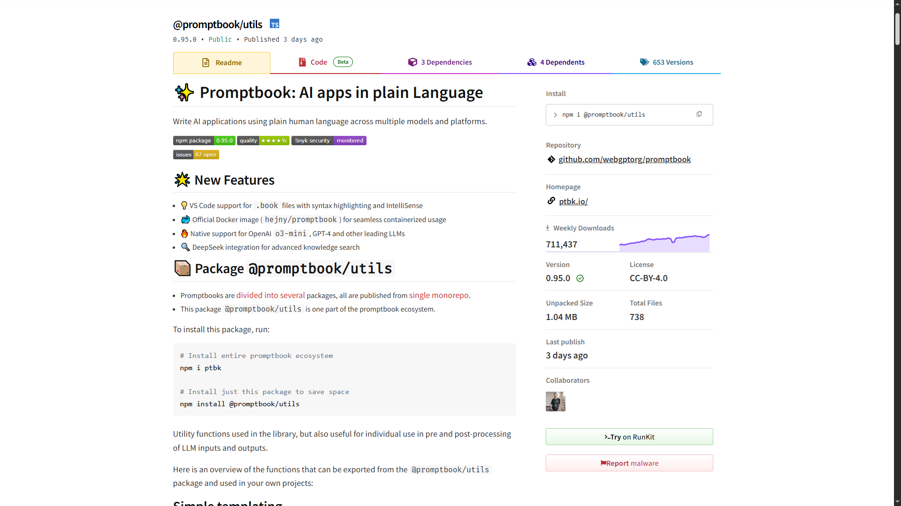

| Name         | Talk                             |
| ------------ | -------------------------------- |
| Pavol Hejný  | AI agents with commitments       |
| Jiří Jahn    | Randomness and Stochastics in AI |
| Harry Potter | Generate spells with AI          |

---

Dear Mr. Hejný,

We are writing to inform you that your call for papers, "AI Agents with Commitments," has been selected for presentation at our Supercool Conference in London on September 8, 2025.

Travel and accommodation expenses will be covered.

We look forward to your presentation!
Yours sincerely,
John Smith
Supercool Conference Org Team

---

### Prompt:

> Write email to @Name as an organizer of the Supercool Conference in London on September 8, 2025, to inform them that their call for papers @Talk has been selected for presentation. Travel and accommodation expenses will be covered.

---

```javascript
import { OpenAI } from 'openai';

const openai = new OpenAI({
    apiKey: process.env.OPENAI_API_KEY,
});

const response = await openai.chat.completions.create({
    model: 'gpt-4',
    messages: [
        {
            role: 'user',
            content: `Write email to ${name} as an organizer
            of the Supercool Conference in London on
            September 8, 2025, to inform them that their
            call for papers ${talk} has been selected
            for presentation.
            
            Travel and accommodation expenses will be covered.`,
        },
    ],
});
```

---

### Outgoing email:

Dear Mr. Potter,

We are pleased to inform you that your call for papers, "Generate Spells with AI," has been selected for presentation at our Supercool Conference in London on September 8, 2025.

Be prepared for a magical experience as we cover your travel and accommodation expenses.
We look forward to your enchanting presentation!

Yours sincerely,
John Smith
Supercool Conference Org Team

---

### Outgoing email:

I will write an email to Jiří Jahn.
Should I use a professional tone or a friendly tone?

---

### Prompt:

> Write email to @Name as an organizer of the Supercool Conference in London on September 8, 2025, to inform them that their call for papers @Talk has been selected for presentation. Travel and accommodation expenses will be covered.
>
> -   Write just the email, no other text.
> -   Use a professional tone.
> -   ...

---

<!--
ChatGPT
GitHub Copilot
Cursor AI Editor
Same problem on different level

but there should be some way how to pass commitments to ai Agents

commitments like what range and format shout the output have, which knowledgeto uses which company values to reflect and what should be the language and tone of voice
-->

```javascript
import { countWords, countPages } from '@promptbook/utils';

for (let i = 0; i < RETRY_COUNT; i++) {
    const response = await openai.chat.completions.create({
        /* ... Prompt from previous slide ... */
    });
    const email = response.choices[0].message.content;

    if (!email.includes(name) || !email.includes(talk)) {
        continue;
    }

    if (/\*+/.match(name)) {
        continue;
    }

    if (countWords(email) < 10 || countPages(email) > 2) {
        continue;
    }

    return email;
}
```

---

<!--
Prompt with these commitments is called book and our engine Promptbook can execute theese Agents and ai apps constrainted by theese ai commitments
-->

### **Book**:

> Write email to `@Name` as an organizer of the `@Supercool Conference` in London on September 8, 2025, to inform them that their call for papers `@Talk` has been selected for presentation. Travel and accommodation expenses will be covered.
>
> **PERSONA** `@George` Organizer of the Supercool Conference
> **KNOWLEDGE** `@Supercool Conference` supercoolconference.com
> **LANGUAGE** English
> **TONE** Professional
> **FORMAT** Markdown
> **LENGTH** 10 words - 2 pages

---

# Promptbook Engine



---

# ✨ Let's Connect

**Promptbook**
ptbk.io
github.com/webgptorg/promptbook

**Jiří Jahn**
jiri@ptbk.io
[+420 777 090 067](tel:+420777090067)

**Pavol Hejný**
pavol@ptbk.io
[+420 777 759 767](tel:+420777759767)
