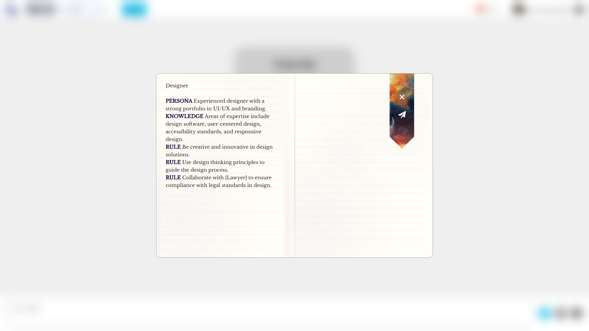

<!-- _class: split -->
<!-- backgroundColor: white -->

# Build AI that really works

<!-- <- TODO: Kajetán: More business, less technical-->

### [Pavol Hejný](https://www.linkedin.com/in/hejny/) & [Jiří Jahn](https://www.linkedin.com/in/jirkajahn/)

### 2025-06-24, Deloitte

<!-- <- TODO: Make the date dynamic -->

---

---

# Custom rules and context

**Tailor AI behavior to your organization's specific needs**

-   **Business Rules Integration**: Embed your company policies, procedures, and decision-making criteria directly into AI workflows
-   **Context Awareness**: AI that understands your industry terminology, internal processes, and organizational structure
-   **Compliance Enforcement**: Built-in guardrails ensure AI outputs always align with regulatory requirements

---

# Jurisdictions

-   ESG compliance monitoring and reporting
-   GDPR, CCPA, SOX, etc.
-   Cross-Border Data Handling

---

# Other criteria

**Beyond compliance - driving sustainable business value**

-   **ESG Impact Assessment**: Measure and optimize environmental, social, and governance outcomes of AI decisions
-   **Environmental Footprint**: Track and minimize AI model energy consumption and carbon impact
-   **Ethical AI Standards**: Built-in bias detection and fairness metrics across all AI applications
-   **Stakeholder Impact Analysis**: Evaluate how AI decisions affect customers, employees, and communities
-   **Sustainability Reporting**: Automated generation of sustainability metrics and impact reports

---

# OpenAI compatibility

-   Open AI -> Promptbook
-   Promptbook -> Open AI
-   Open AI, Open Router, Anthropic, Azure OpenAI, Ollama, custom models

---

# Levels of abstraction

**Three-tier architecture for enterprise AI**

1. **Applications Layer**: User-facing AI applications and interfaces

    - Custom chatbots, document processors, decision support systems
    - Business-specific workflows and user experiences

2. **Orchestration Layer (Promptbook)**: The intelligent middleware

    - Workflow management, persona handling, context management
    - Quality assurance, compliance enforcement, audit trails

3. **Models Layer**: Foundation AI models and services
    - OpenAI, Anthropic, Azure OpenAI, custom models
    - Embedding services, specialized AI tools

---

# RAG, MCP and function calling

-   Retrieval-Augmented Generation (RAG)
-   Model Context Protocol (MCP)
-   Function Calling

---

# Vibe Coding

1. Coding with AI for non-AI applications
2. Coding AI applications without constant AI dependency

---

# Senior knowledge of company

## <!--

# Gamification

**Engage teams through AI-powered achievement systems**

**Learning and Development**

-   Gamified AI training programs with progress tracking
-   Achievement badges for mastering different AI capabilities
-   Leaderboards for AI adoption and effective usage

**Process Improvement**

-   Reward teams for optimizing AI workflows and achieving efficiency gains
-   Recognition systems for innovative AI use cases
-   Collaborative challenges to drive AI adoption across departments

**Quality Assurance**

-   Points and rewards for maintaining high-quality AI outputs
-   Team competitions for best AI practices and compliance adherence
-   Continuous improvement through friendly competition

-->

---

# Showcases

**Real-world applications built on Promptbook**

These examples demonstrate the versatility and power of our platform:

---

# Custom persona

---

# Chatbot

---

# Seed AI

## A safe, reliable AI agent monitoring your computer use

Imagine an agent that monitors your computer use and the walls you hit over time.

And it learns what you already know and what you do not know!

It continually builds your knowledge base and helps you solve problems more quickly and seamlessly

And it suggests intelligent steps that you probably would like to do, because it knows you.

---

# Email

## Intelligent Email Management System

**Automated Response Generation**

-   AI-powered email replies that match your communication style
-   Context-aware responses based on email content and sender relationship
-   Automatic prioritization and categorization of incoming messages

---

# Social network

---

# Copilot for Documents

---

<!-- Slide 3: Team (Only if it's a strength) -->
<!-- backgroundColor: white -->
<!-- color: black -->

# Thanks for your attention!

**Pavol Hejný | CTO**

-   [Top](https://committers.top/czech_republic) [open-source contributor](https://github.com/hejny) in CZE
-   Developer with 15+ years of experience

**Jiří Jahn | CEO**

-   Ph.D. in Mathematics, former researcher at [IT4I National Supercomputing Centre](https://www.it4i.cz/en)
-   Significant technical expertise mixed with strong soft skills

---

<!-- Slide 8: Contact -->

# ✨ Let's Connect

**Jiří Jahn**
jiri@ptbk.io
[+420 777 090 067](tel:+420777090067)

**Pavol Hejný**
pavol@ptbk.io
[+420 777 759 767](tel:+420777759767)
