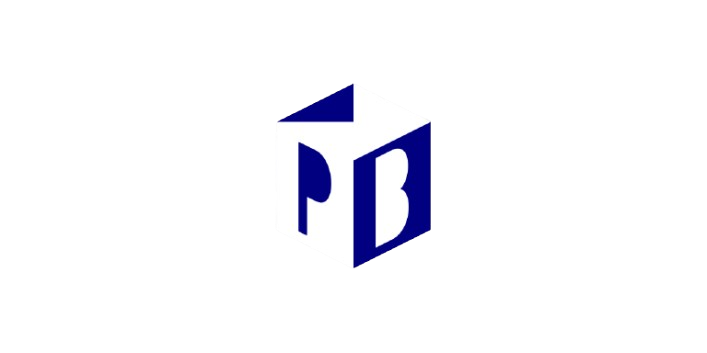

<!-- _class: split -->



# Build AI that really works
## How Promptbook helps the transition from typewriters to personal computers 
### Pavol Hejný & Jiří Jahn (@ptbk.io)
### 2025-02-18

---

<!-- Slide 1: What We Do (Clear, concise, 2 sentences) -->
# Promptbook

**What do we do?**
<!-- You do want to have your C3PO -->
- We develop a new language for AI.
- You do not need ML Department to create your own personal AI app, agent, assistant that knows you (think Batman's Alfred)
- You just write simple markdown the gets executed:
````
# ✨ Example

Example to test whether the providers are working correctly.

## 💬 Prompt

```text
Hello
```

`-> {greetingResponse}`
````


---

<!-- Slide 2: Specific Example -->
# Real World Example

<!-- Specific, detailed example showing your solution in action -->

- **Who:** A global, Big Four professional services firm
- **Problem:** Had thousands survey responses that would take weeks to analyze manually
- **Solution:** Used the Promptbook ecosystem to process responses automatically
- **Result:** Delivered complete analysis in 2 days, significantly reducing need for developer nor labor costs

---

<!-- Slide 3: Team (Only if it's a strength) -->
# Our Team

<div class="image-grid">


</div>

- **Pavol Hejný, CTO & Co-founder**
  - Top open source contributor in CZE
  - Programmer

- **Jiří Jahn, CEO & Co-founder**
  - Ph.D. in Mathematics, former researcher at IT4I National Supercomputing Centre
  - Significant technical expertise mixed with strong soft skills

<!-- --- -->

<!-- Slide 4: Traction (Only if strong) -->
<!-- # Traction

<div class="grid">
<div>

## Key Metrics
- [Specific metric] in [timeframe]
- [Growth rate] over [period]
- [Key milestone] achieved in [time]

</div>
<div>

## Timeline
- [Month Year]: Started development
- [Month Year]: [Important milestone]
- [Month Year]: [Current achievement]

</div>
</div> -->

---

<!-- Slide 5: Unique Insights -->
# Our Unique Insights

1. **We are not NO CODE platform**
   - For **devs** these platforms lack control
   - For **non/devs** they are still programming with a crutch

2. **Anticipating Problems**
   - Mixing prompts with code will lead to technical debt
   - We are separating things that should be separated

3. **Models are commodity, we make the best assistants**
   - Models are like Intel processors in Apple
   - You can replace Intel with Arm, but you cannot replace Apple

---

<!-- Slide 6: Market Size -->
# Market Size

## Bottom-up Calculation
- [Number of potential users] × [Price per user] = [Total addressable market]
- In 2025: 1000 users × $50 per month × 12 months = $600,000 annual revenue potential
- In 2026: Potential growth to 5000 users = $3M/year
- In 2027: Potential growth to 15,000 users = $9M/year
- These are quite conservative estimates

## Market Positioning
- **Our Solution:** $99 per user/month
- **Competitors:** $200-500 per user/month for more narrow solutions

---

<!-- Slide 7: The Ask -->
# Investment Opportunity
- **Raising:** $500,000
- **Timeline:** 18-24 months to reach key milestones

**Key Milestones:**
- Reach 1,000 active users ($600K ARR) by end of 2025
- Launch enhanced UI to attract more users
- Expand team with key hires in sales and development
- Begin scaling to 5,000 users for 2026 ($3M ARR)<>

**Use of Funds:**
- Product development and AI capabilities
- Go-to-market strategy execution
- Key strategic hires

---

<!-- Slide 8: Contact -->
# Let's Connect

**Jiří Jahn**
jiri@ptbk.io
+420 777 090 067

**Pavol Hejný**
pavol@ptbk.io
+420 777 759 767