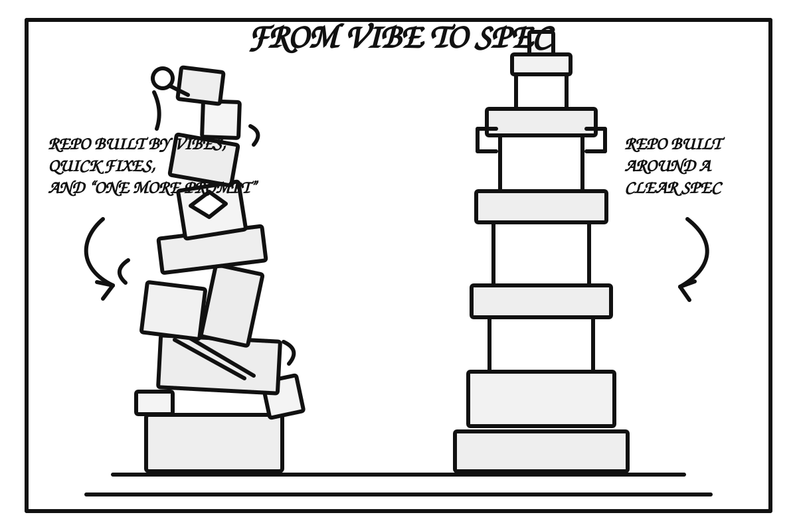

<!-- _class: cover -->
<!-- _header: '' -->

AI Horizons · 23.9.2026

# From [HV]ibe to Spec

Aneb proč má dobré zadání cenu zlata, zatímco cena samotného kódu míří k nule.

<strong>Pavol Hejný</strong> · Promptbook

Network name: AIHorizons  
Password: Prague2026

---

  

<!-- INTRO: PROBLÉM -->

---

<!-- _class: cover -->

# Čím déle projekt žije, tím víc stojí každá další změna.

---

<!-- _class: cover -->

Hackathon / Vibe coding

# `24 hodin` → fungující appka

A ten moment je **opravdu wow**.

---

<!-- _class: cover -->

O pár let později

# `1 tlačítko` → půl roku

A několik lidí, několik meetingů a několik milionů.

---

<!-- _class: cover -->

# Mezi těmito dvěma slidy je hlavně **historie**.

---

# Architektura má zpožděný feedback

### Na začátku

**Skoro všechno funguje.**

Projekt je malý, vazeb je málo a špatná rozhodnutí ještě nejsou vidět.

### Později

**Každá změna něco rozbije.**

Rozhodnutí z prvních dnů mezitím prorostla celým systémem.

---

<!-- _class: cover -->

# Pozdější fixy jsou drahé.

Špatný základ je levný jenom **jednou**.

---

<!-- _class: cover -->

# AI tenhle problém neodstranila.

## AI ho umí **brutálně zrychlit**.

---

# A přidala druhou časovou osu

### Projekt

Čím je starší, tím je změna obvykle **dražší**.

čas → ↑ složitost

### Modely

Čím jdeme dál, tím máme k dispozici **silnější nástroje**.

čas → ↑ schopnosti

Tyhle dvě osy jdou proti sobě.

---

<!-- _class: cover -->

# Projekt stárne. Modely mládnou.

Dnešní model by možná stejný základ postavil lépe než model, který jsme měli před půl rokem.

---

<!-- _class: cover -->

# Někdy je levnější repo zahodit než ho dál opravovat.

**Pokud dokážeme zachovat to, co je na něm hodnotné.**

<!-- INTRO: ZRNO A PLEVY -->

---

# Co je na staré appce skutečně hodnotné?

### Hodnota

- business pravidla
- chování produktu
- data
- doménové know-how
- rozhodnutí, která se osvědčila

### Není nutně hodnota

- konkrétní struktura souborů
- historické workaroundy
- náhodná komplexita
- boilerplate
- kód jen proto, že už existuje

---

<!-- _class: cover -->

# Hodnota ≠ kód

Legacy systém je často **hodnota promíchaná s balastem**.

---

<!-- _class: cover -->

# Jedna z nejcennějších schopností inteligence je **sumarizace**.

Oddělit **zrno od plev**.

---

<!-- _class: cover -->

# Co kdybychom zrno od plev oddělovali už **od začátku**?

<!-- INTRO: SPEC JAKO SOURCE OF TRUTH -->

---

# Co je source of truth?

### Dnes často

# Repo

„Takhle to nějak funguje. Podívej se do kódu.“

### From Vibe to Spec

# Specifikace

„Takhle se to má chovat. Implementaci můžeme vyměnit.“

---

<!-- _class: cover -->

# Specifikace = produktová paměť

## Kód = jedna konkrétní implementace

---

# Tohle není první abstrakční posun

machine code → assembler → C → frameworky → deklarativní systémy → …

Další vrstva může být: <strong>spec → generovaná implementace</strong>

---

<!-- _class: cover -->

# Kód už dávno „generujeme“.

Cílem není vlastnit každý řádek assembleru.  
Cílem je vlastnit **správnou abstrakci nad ním**.

<!-- INTRO: LIDÉ + AI -->

---

# Dva světy AI vývoje

### Zkušený vývojář

Umí posoudit architekturu a kvalitu.

Ale často stále bere **kód jako hlavní artefakt** a reviewuje ho řádek po řádku.

### Vibe coder

Umí neuvěřitelně rychle vyrobit funkční výsledek.

Ale nemusí umět poznat, **co se pokazilo pod povrchem**.

Potřebujeme spojit rychlost jednoho se zkušeností druhého.

---

<!-- _class: cover -->

Nejhorší ekonomika AI

# AI pracuje pár minut.

## Senior pak dvě hodiny reviewuje její výstup.

---

<!-- _class: cover -->

Lepší ekonomika AI

# Senior pracuje krátce na zadání a pravidlech.

## AI pak může pracovat dlouho na implementaci.

---

<!-- _class: cover -->

# Přesuňme review **o vrstvu výš**.

Nejdřív reviewujeme **záměr, pravidla a acceptance**.  
Ne `20 000` řádků vygenerovaného diffu.

---

<!-- _class: cover -->

# Ale spec se nesmí stát novým AI slopem.

AI může pomoct draftovat.  
**Člověk musí rozhodovat, co je důležité.**

---

<!-- _class: cover -->

# Kód zlevňuje. Specifikace zdražuje.

Tohle je celý **From Vibe to Spec**.

<!-- LIVE CODING -->

---

<!-- _class: cover -->

Live coding

# Dost slidů. Jdeme stavět.

---

<!-- _class: cover -->

0 · Distill

# Co je na tomhle projektu skutečně hodnotné?

Business. Chování. Data. Omezení. Rozhodnutí.

---

<!-- _class: cover -->

1 · Spec

# Sepíšeme **co a proč**.

`spec.md`

---

<!-- _class: cover -->

2 · Acceptance

# Jak objektivně poznáme, že je hotovo?

`acceptance.md`

---

<!-- _class: cover -->

3 · Guardrails

# Co AI nesmí změnit ani „vylepšit“?

Pravidla · invariants · architektura · hranice systému

---

<!-- _class: cover -->

4 · Plan

# Plán je **odvozený artefakt**.

`plan.md` můžeme zahodit a vytvořit znovu.

---

<!-- _class: cover -->

5 · Build

# Necháme agenta dělat to, v čem je levný.

Implementovat. Zkoušet. Opravovat. Opakovat.

---

<!-- _class: cover -->

6 · Verify

# Neptáme se „líbí se mi ten diff?“

Ptáme se: **splňuje implementace spec a acceptance?**

---

<!-- _class: cover -->

7 · Regenerate

# Když je implementace špatná, nemusíme ji zachraňovat.

Spec zůstává.  
Kód můžeme udělat znovu.

---

<!-- _class: cover -->

8 · Iterate

# Každá změna začíná ve specifikaci.

SPEC → PLAN → BUILD → VERIFY → SPEC

<!-- WRAP-UP -->

---

# Hierarchie toho, co chráníme

### Hýčkáme

1. **Záměr / spec**
2. **Acceptance / pravidla**

Lidsky čitelné. Kurátorované. Stabilní.

### Regenerujeme

3. **Plan**
4. **Implementation**

Odvozené. Levnější. Nahraditelné.

---

<!-- _class: cover -->

# Lidský seniorní čas je drahý.

## AI čas bude čím dál levnější.

---

<!-- _class: cover -->

# Neoptimalizujme počet napsaných řádků.

## Optimalizujme množství **lidské pozornosti**, kterou systém potřebuje.

---

<!-- _class: cover -->

# Kód zlevňuje.

# Specifikace zdražuje.

---

<!-- _class: cover -->

# Díky za pozornost!

<strong>Pavol Hejný</strong> · Promptbook

