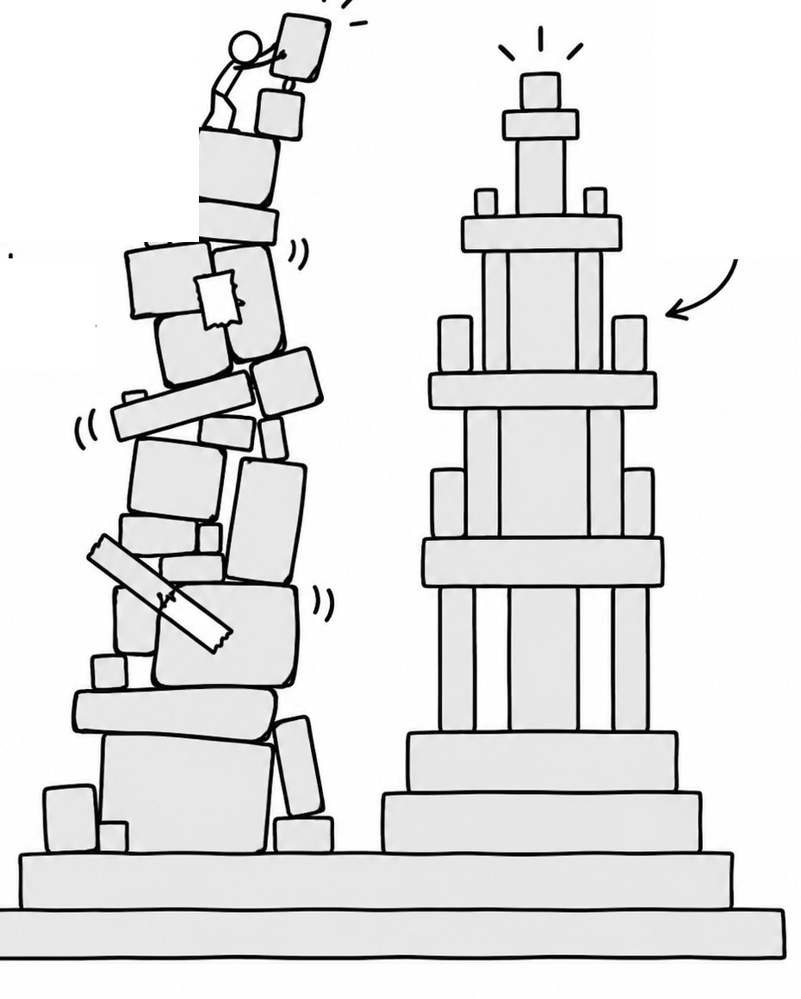
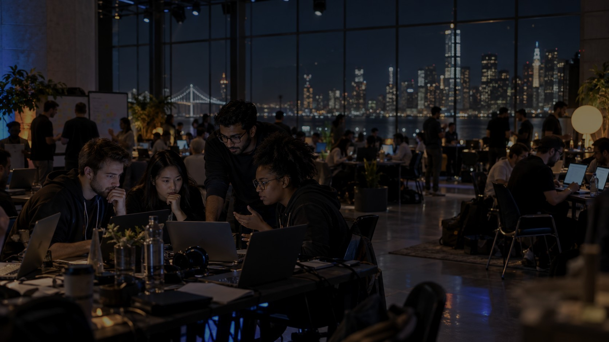
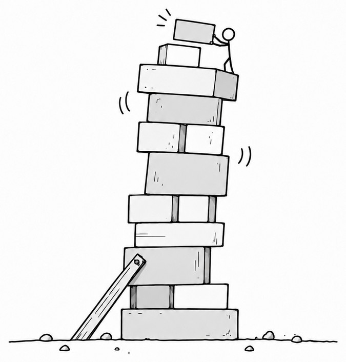
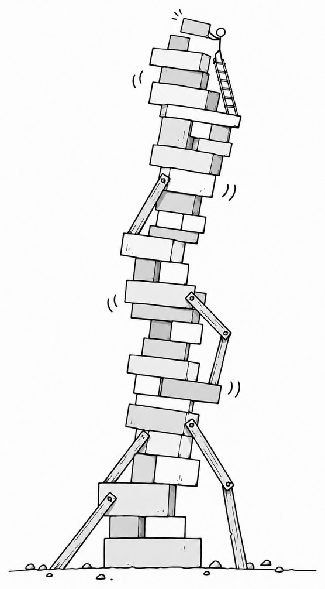
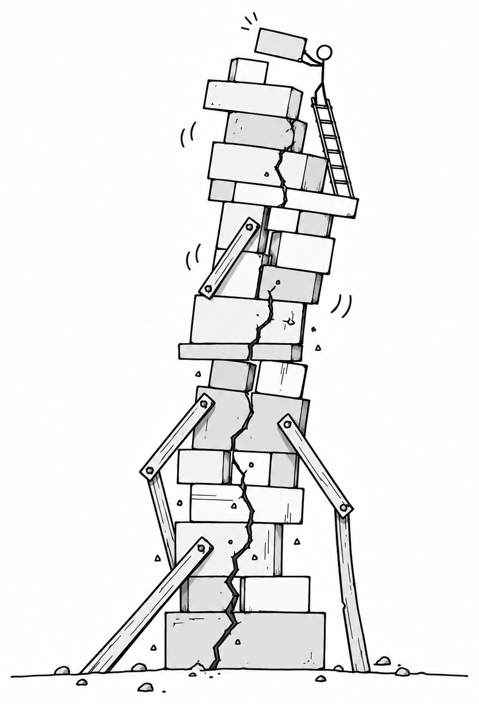
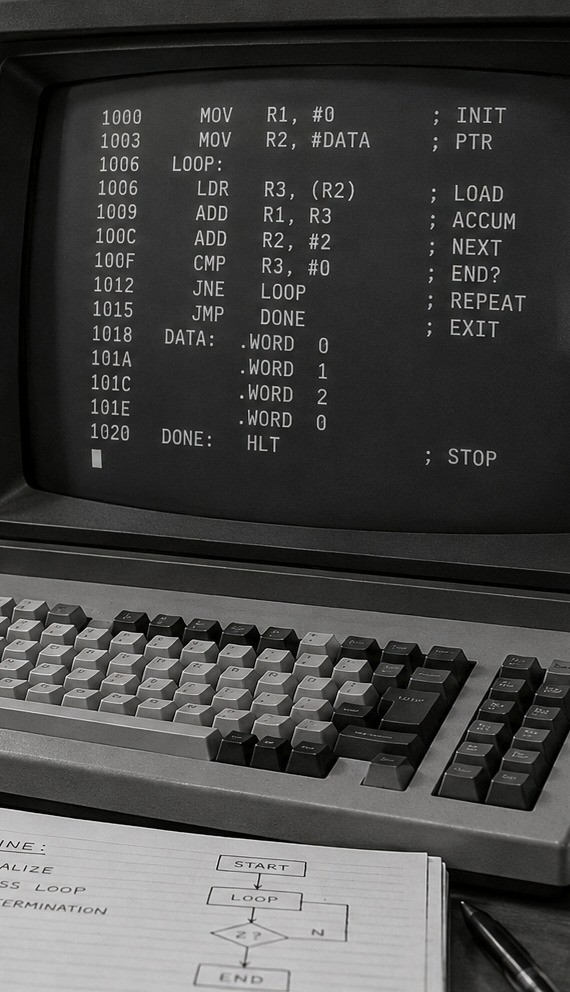
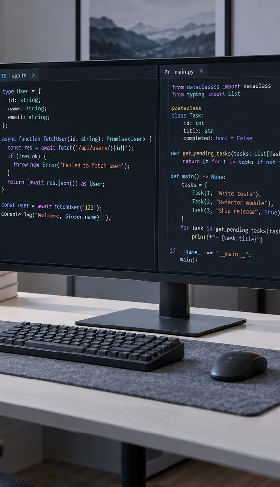

<!-- _class: cover -->

<h1 class="cover-title">From Vibe to Spec</h1>

Kód zlevňuje. Specifikace zdražuje.

Pavol Hejný pavolhejny.com

AI HORIZONS · 24. 9. 2026

---

<!-- _class: center -->

From Vibe to Spec

A repo built by vibes, quick fixes and one more prompt

A repo designed around a clear spec

---

<!-- _class: dark center -->

10 minut ➜

---

<!-- _class: photo -->

<h1 class="photo-title">48 hodin a máme produkt.</h1>

---

<!-- _class: photo -->

<h2 style="color:#fff">Posunout jedno tlačítko?</h2>
6 měsíců!

---

<!-- _class: photo -->

<h1 class="photo-title">Claude Code míří na legacy.</h1>

---

<!-- _class: center -->

Architektura: zpožděný feedback

<h1 class="two-line">Čím déle projekt žije, tím víc stojí každá další změna.</h1>

---

<!-- _class: -->
<h2>Architektura: zpožděný feedback</h2>

DEN 1

ZMĚNY

FEEDBACK

---

<!-- _class: -->

<h1>Pozdější fixy jsou drahé.</h1>

---

<!-- _class: dark center -->
<h1 style="color:#fff">AI tenhle problém neodstranila.</h1>

---

<!-- _class: -->
<h2>Paradox dvou časových os</h2>

MODELY SÍLÍ ➜

◀ NEJLEPŠÍ MODEL POTŘEBUJEME NA ZAČÁTKU

---

<!-- _class: -->
<h2>Co je na staré appce skutečně hodnotné?</h2>

● &nbsp;● &nbsp;●

<i></i><i></i><i></i>
<b>BUSINESS</b>

▦
<b>DATA</b>

●─●
<b>CHOVÁNÍ</b>

---

<!-- _class: dark center -->

[ HODNOTA ]≠{{ KÓD }}

---

<!-- _class: center -->
<h1>Někdy je levnější repo zahodit než ho dál opravovat.</h1>

---

<!-- _class: photo -->

<h2>Jedna z nejcennějších schopností AI je oddělit zrno od plev.</h2>
A co kdybychom to dělali rovnou od začátku?

---

<!-- _class: -->
<h2>Tohle není první abstrakční posun.</h2>

MACHINE CODE

›

ASSEMBLER

›

C / C++

›

TYPESCRIPT / PYTHON

›

SPEC

---

<!-- _class: -->
<h2>Kód už dávno generujeme.</h2>

C

compiler　➜

ASSEMBLY

TypeScript

transpiler　➜

JavaScript

SPEC

agent　➜

CODE

---

<!-- _class: -->
<h2>Lidský čas je drahý. AI čas je levný.</h2>

<b>1h</b>seniora

<i>AI</i><i>AI</i><i>AI</i><i>AI</i><i>AI</i><i>AI</i><i>AI</i><i>AI</i><i>AI</i><i>AI</i><i>AI</i><i>AI</i><i>AI</i><i>AI</i><i>AI</i>

---

<!-- _class: dark -->

<h2>KÓD</h2>
↓

ZLEVŇUJE

<h2>SPECIFIKACE</h2>
↑

ZDRAŽUJE

---

<!-- _class: -->
<h2>Spec se nesmí stát novým AI slopem.</h2>

× notes ideas more notes

✓ &nbsp; SPEC

Minimum, které stačí k znovuvyrobení stejné aplikace.

---

<!-- _class: factory -->

<h1 class="factory-title">A co kdyby se celý projekt psal sám?</h1>

---

<!-- _class: dark center -->
<h2>Dark Factories</h2>

SPEC

BUILD

TEST

MEASURE

---

<!-- _class: cover -->

<h1 class="cover-title">Díky.</h1>
Kód zlevňuje. Specifikace zdražuje.

Pavol Hejný pavolhejny.com

AI HORIZONS · 24. 9. 2026

